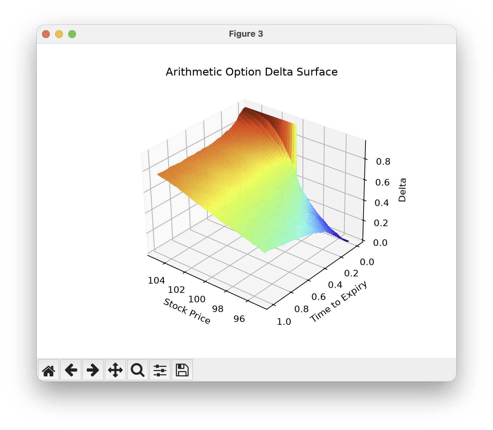

# option_pricer

The report/ interactive dashboard can be found in this link:

https://mcoptionpricer.streamlit.app/

See below how to run the report locally. 

## Introduction

This repository contains the implementation of the following pricers:

- Vanilla call- and put-option pricer under a Black-Scholes-Merton scenario.

- Vanilla call- and put-option pricer using Monte Carlo methods.

- Arithmetically averaged call- and put-option pricer using Monte Carlo methods.

The first pricer was also adapted to describe geometrically average call and put options. 




## Installation

All required packages are listed in the `pyproject.toml`. It is highly recommended
to install them in a local virtual environment, following the steps below.

```bash
python -m venv .venv_pricer
source .venv_pricer/bin/activate
python -m pip install -e ".[dev]"
```

After installation is complete, source the local environment with

```bash
source ./venv_pricer/bin/activate
```

I noticed that, sometimes, the local `python` is found and usable, while `pytest` is not. 
It is recommended to determine which executable is being used

```bash
which python pytest
```

If `pytest` cannot find any scripts in the `tests` folder, try the following

```bash
python -m pytest -sv
```

## Usage

Here is an example of a script to test the vanilla option class. 

```python
import numpy as np
import matplotlib.pyplot as plt
from option_pricer.vanilla import VanillaOptionBS, VanillaOptionMC

def test_call_option():
    option = VanillaOptionBS(
        K=100,
        S=[97.5, 100, 102.5], 
        sigma=0.2, 
        r=0.05,
        t=1
    )
    price = option.call()

    fig, ax = plt.subplots() 
    ax.plot(option.ts, price)
    ax.set_title("Call Option Price vs Time")
    plt.show(block=False)
    
    assert isinstance(price, np.ndarray) or isinstance(price, float)
```

## Highly Recommended

After sourcing the local environment, run the complete test suite:
```bash
python -m pytest -sv
```

This will generate the 3D surface plots for both vanilla BSM and MC pricers,
and the arithmetically averaged pricer. 


## Report 

As part of the Quant Finance Summer 2026 cohort program at The Erdos Institute, 
a report explaining motivations, implementation and examples is provided in 
the respective folder. 

As mentioned above, this report can be found online in this link:

https://mcoptionpricer.streamlit.app/

However, should you run into any troubles, you can run it locally. For that,
source the local environment then follow these steps:

```bash
mv ./report
streamlit run app.py --server.runOnSave true --server.maxMessageSize 500
```

A web browser tab should pop right up, running the simulations on the backend. 